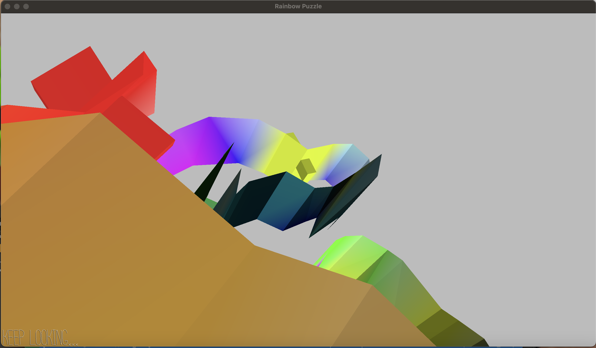

# Rainbow Puzzle

Author: Charvi Hoysal

Design: Walk around the 3D maze with branching paths and inspect your surroundings to decipher the secret and win the game!

Screen Shot:

Credit & Additional Help: 
The WalkMesh.cpp barycentric_weights and walk_in_triangle functions are from what we worked together on in class.

More detail in the actual file, but I coded the cross_edge functions with help from Mandy Hu and Taylor Kynard.

All assets are my own, created in Blender.

How To Play:

WASD to move around the map, move mouse to move camera (standard default controls)
Hit either 1 or 0 one at a time to enter your answers into the sequence!
Hit space to reset the game and/or reset the current answer you are typing

Hints (in order of basic -> giving the answer away):
1) its a 6 note sequence
2) in rainbow order
3) narrow blocks are 0, wide blocks are 1
4) ANSWER SPOILERS: 

100011

This game was built with [NEST](NEST.md).

